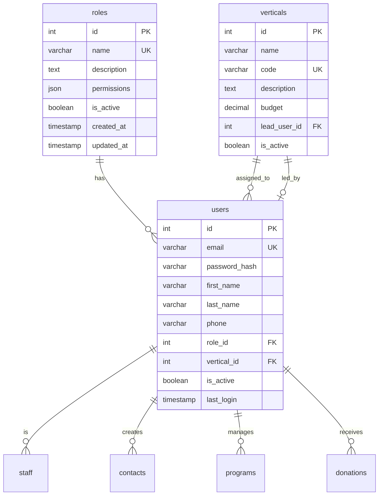
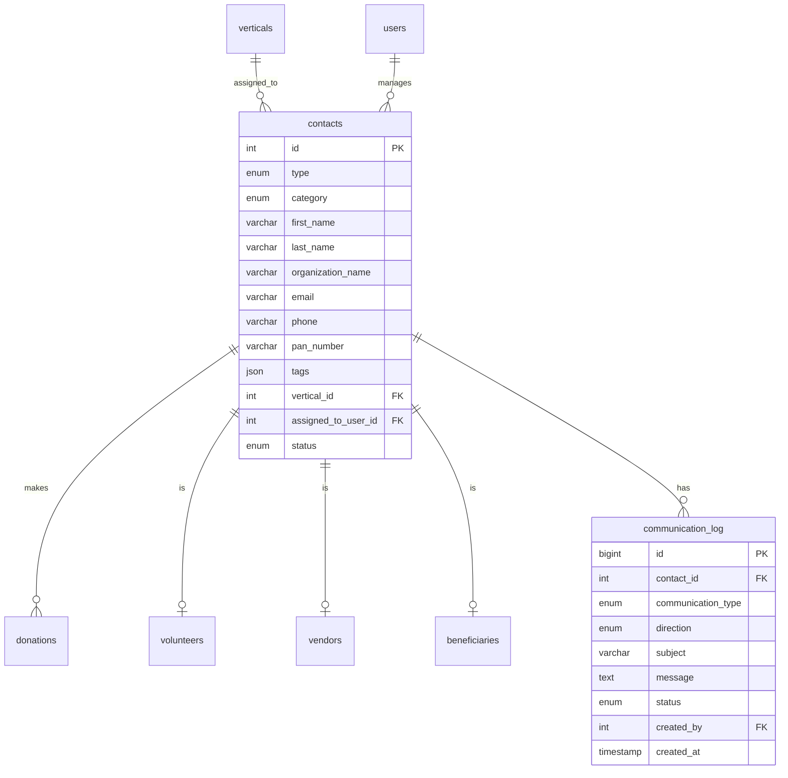
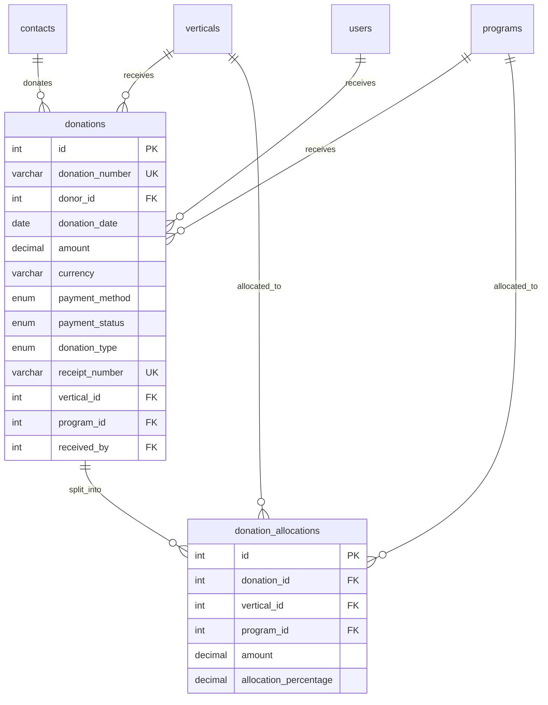
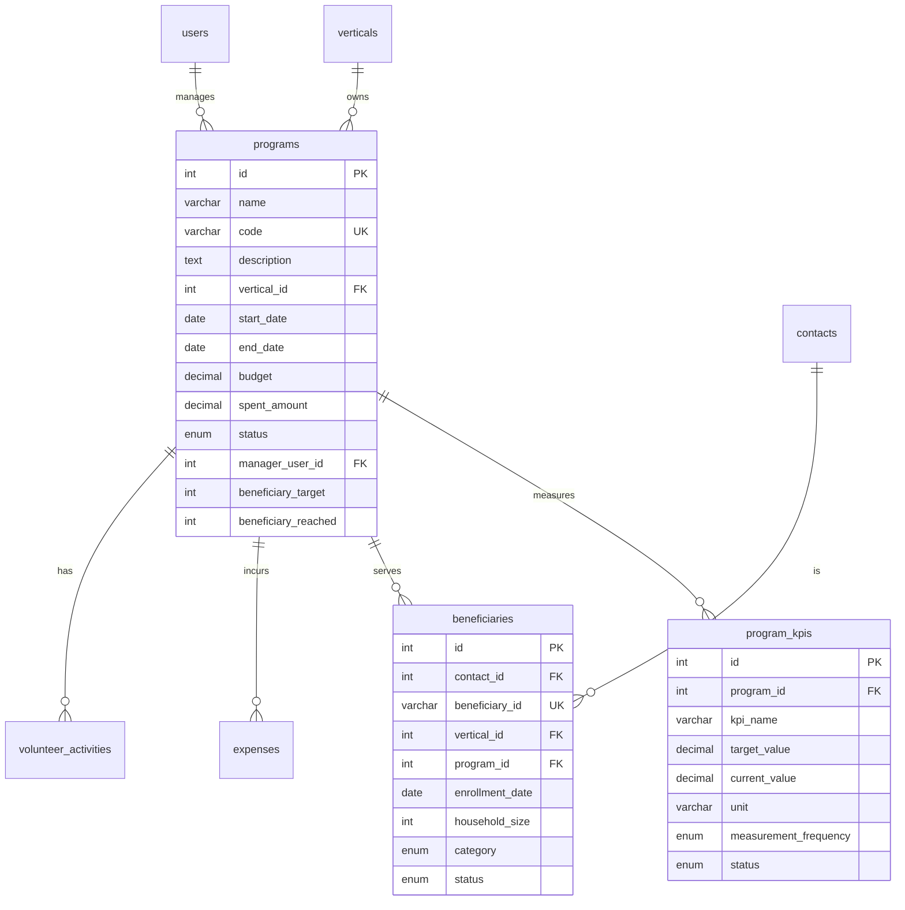
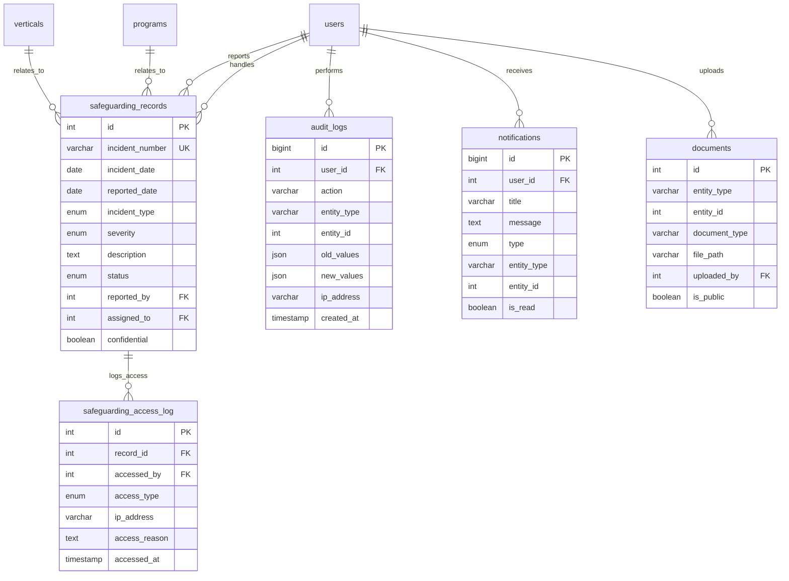
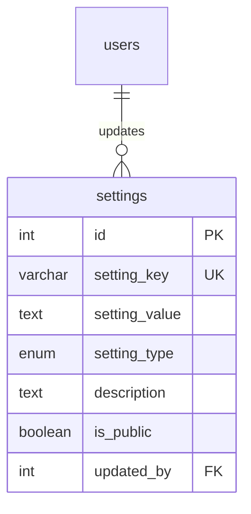
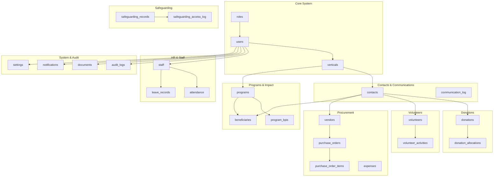

# Entity Relationship Diagram (ERD)

## Core System ERD



## Contact Management ERD



## Donations & Allocations ERD



## Programs & Impact ERD



## Volunteer Management ERD

```mermaid
erDiagram
    contacts ||--o| volunteers : "is"
    volunteers ||--o{ volunteer_activities : "performs"
    programs ||--o{ volunteer_activities : "has"
    verticals ||--o{ volunteer_activities : "has"
    users ||--o{ volunteer_activities : "supervises"
    users ||--o{ volunteer_activities : "verifies"
    
    volunteers {
        int id PK
        int contact_id FK UK
        varchar volunteer_id UK
        date join_date
        enum tier
        decimal total_hours
        json skills
        varchar insurance_policy_number
        date insurance_expiry
        enum police_verification_status
        boolean orientation_completed
        enum status
    }
    
    volunteer_activities {
        int id PK
        int volunteer_id FK
        date activity_date
        int program_id FK
        int vertical_id FK
        varchar activity_type
        decimal hours
        int supervisor_user_id FK
        boolean verified
        int verified_by FK
    }
```

## HR & Staff Management ERD

```mermaid
erDiagram
    users ||--o| staff : "is"
    staff ||--o{ attendance : "has"
    staff ||--o{ leave_records : "applies"
    staff ||--o| staff : "reports_to"
    users ||--o{ leave_records : "approves"
    
    staff {
        int id PK
        int user_id FK UK
        varchar employee_id UK
        date join_date
        enum employment_type
        varchar designation
        decimal salary
        varchar pan_number
        varchar aadhar_number
        int reporting_to FK
        enum status
    }
    
    attendance {
        int id PK
        int staff_id FK
        date attendance_date
        time check_in
        time check_out
        enum status
        decimal work_hours
        varchar location
    }
    
    leave_records {
        int id PK
        int staff_id FK
        enum leave_type
        date start_date
        date end_date
        decimal total_days
        text reason
        enum status
        int approved_by FK
    }
```

## Procurement & Finance ERD

```mermaid
erDiagram
    contacts ||--o| vendors : "is"
    vendors ||--o{ purchase_orders : "receives"
    purchase_orders ||--o{ purchase_order_items : "contains"
    verticals ||--o{ purchase_orders : "creates"
    programs ||--o{ purchase_orders : "funds"
    users ||--o{ purchase_orders : "creates"
    users ||--o{ purchase_orders : "approves"
    
    verticals ||--o{ expenses : "incurs"
    programs ||--o{ expenses : "incurs"
    vendors ||--o{ expenses : "bills"
    users ||--o{ expenses : "claims"
    users ||--o{ expenses : "approves"
    
    vendors {
        int id PK
        int contact_id FK UK
        varchar vendor_code UK
        varchar category
        decimal credit_limit
        decimal rating
        boolean blacklisted
        enum status
    }
    
    purchase_orders {
        int id PK
        varchar po_number UK
        int vendor_id FK
        date po_date
        int vertical_id FK
        int program_id FK
        decimal net_amount
        enum status
        int approved_by FK
        int created_by FK
    }
    
    purchase_order_items {
        int id PK
        int po_id FK
        text item_description
        decimal quantity
        decimal unit_price
        decimal total_price
        decimal received_quantity
    }
    
    expenses {
        int id PK
        varchar expense_number UK
        date expense_date
        varchar category
        decimal amount
        int vertical_id FK
        int program_id FK
        int vendor_id FK
        enum payment_method
        int claimed_by FK
        enum status
        int approved_by FK
    }
```

## Safeguarding & Audit ERD



## System Configuration ERD



## Complete Database Overview



## Key Relationships Summary

### One-to-Many Relationships
- 1 role → many users
- 1 vertical → many users (assigned)
- 1 vertical → 1 user (lead)
- 1 user → many contacts (created)
- 1 contact → many donations
- 1 donation → many allocations
- 1 vertical → many programs
- 1 program → many KPIs
- 1 volunteer → many activities
- 1 staff → many attendance records
- 1 vendor → many purchase orders
- 1 PO → many PO items

### One-to-One Relationships
- 1 contact → 1 volunteer (contact can be a volunteer)
- 1 contact → 1 vendor (contact can be a vendor)
- 1 contact → 1 beneficiary (contact can be a beneficiary)
- 1 user → 1 staff (user can be staff)

### Many-to-Many Relationships (via junction tables)
- donations ←→ verticals (via donation_allocations)
- donations ←→ programs (via donation_allocations)
- volunteers ←→ programs (via volunteer_activities)
- programs ←→ contacts/beneficiaries

## Table Size Estimates (for 1 year of operation)

| Table | Estimated Rows | Growth Rate |
|-------|----------------|-------------|
| users | 50-100 | Slow |
| roles | 3-10 | Very Slow |
| verticals | 5-20 | Very Slow |
| contacts | 1,000-5,000 | Medium |
| donations | 500-2,000 | Medium |
| programs | 20-100 | Slow |
| volunteers | 100-500 | Medium |
| volunteer_activities | 5,000-20,000 | Fast |
| staff | 20-100 | Slow |
| attendance | 5,000-25,000 | Fast |
| audit_logs | 100,000-500,000 | Very Fast |
| notifications | 10,000-50,000 | Fast |
| safeguarding_records | 0-50 | Very Slow |

**Fast growing tables** (consider archival strategy):
- audit_logs (archive after 12 months)
- volunteer_activities (keep all)
- attendance (archive after 2 years)
- notifications (delete after read + 30 days)
- communication_log (archive after 2 years)
